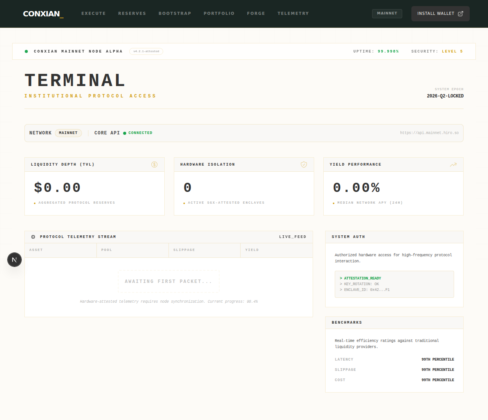

# Welcome to the Conxian UI

Conxian UI is the official, Sovereign Earthy–themed interface for interacting with Conxian contracts on the Stacks blockchain. Whether you're a casual user or a seasoned pro, it provides a single, unified experience.

## Purpose

Conxian UI provides a user-facing dashboard for interacting with Conxian protocol primitives and surfacing protocol and gateway state.

## Status

Active development (beta). UI and integrations may change; expect breaking changes.

We're iterating on UX toward a brighter, lower-fatigue interface while maintaining the Sovereign Earthy brand. The UI is built on a 60-30-10 palette split: 60% Ivory (#FDFBF7) base, 30% Pure White (#FFFFFF) surface layers, and 10% deep brand accents.

## Audience

- End users interacting with Conxian protocol features.
- Integrators validating contract flows and Gateway API behavior.
- Frontend contributors extending components, pages, and protocol integrations.

## Relationship to the Conxian stack

- Frontend layer for [Conxian Protocol](https://github.com/Conxian/Conxian) and [Conxian Gateway](https://github.com/Conxian/conxian-gateway).
- Often run and deployed as part of [conxius-platform](https://github.com/Conxian/conxius-platform) (Conxius platform stack).

## Our Signature Look: The Conxian Color Palette

Our "earthy corporate finance" theme is designed to be both professional and inviting:

* **Primary**: #2E403B (a deep, calming green)
* **Accent**: #D4A017 (a touch of sophisticated gold)
* **Neutrals**: #FDFBF7, #FFFFFF, #333333 (for a clean, modern look)

## Getting Started

For a complete guide on how to use the Conxian UI, please see our [User Guide](GUIDE.md).

## Smart Contracts

The Conxian UI is powered by a suite of smart contracts on the Stacks blockchain. For a detailed explanation of the on-chain architecture, please see our [Architecture Guide](ARCHITECTURE.md).

Key contracts include:
*   **DEX Factory (`dex-factory-v2`)**
*   **DEX Router (`dex-router`)**
*   **Vault (`vault`)**
*   **Oracle Aggregator (`oracle-aggregator`)**
*   **Circuit Breaker (`circuit-breaker`)**
*   **CXD Token (`cxd-token`)**
*   **Staking (`cxd-staking`)**
*   **Bond Factory (`bond-factory`)**

## Contributing

We welcome contributions from the community. Please see our [Contributing Guide](CONTRIBUTING.md) for more information on how to get started.
